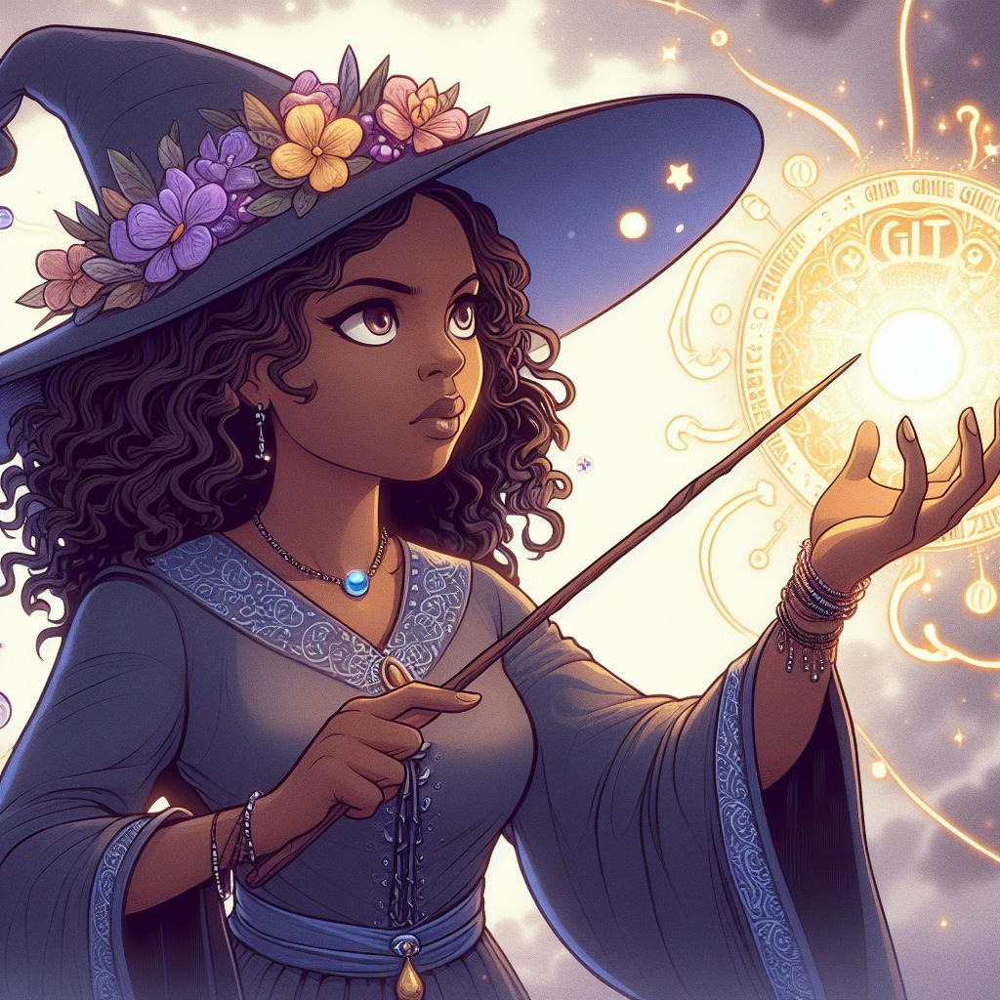

# The Magical Adventures of Sarah the Git Sorceress

## Chapter 1: Sarah's Enchanted Discovery

Sarah was a curious young coder who loved making her computer dance with code.
One day, she overheard her coding companions whispering about a mysterious force
called "Git." Her friend Max explained that Git was a powerful magic that helped
them keep track of their code and work together harmoniously.

With Max's guidance, Sarah began her journey into the realm of Git, learning
enchantments like "git commit" and "git switch" to capture snapshots of her
code's progress and move between different timelines. She felt like a powerful
sorceress, weaving intricate spells to tame her code.

## Chapter 2: Fixing Magical Mishaps

Sarah's adventures with Git were full of excitement, but even the most skilled
sorceress could make a mistake. That's when she learned the power of spells like
"git commit --amend" and "git restore" to undo her magical mishaps.

And when she needed to modify her most recent enchantment, Sarah would cast the
"git commit --amend" spell. This allowed her to add or tweak her code changes
without creating a new commit, keeping her magical code history neat and tidy.
With "git restore," Sarah could undo any accidental changes she made to her
code, restoring it to its previous state with a simple incantation.

Story by Claude, the Enchanted AI Storyteller
