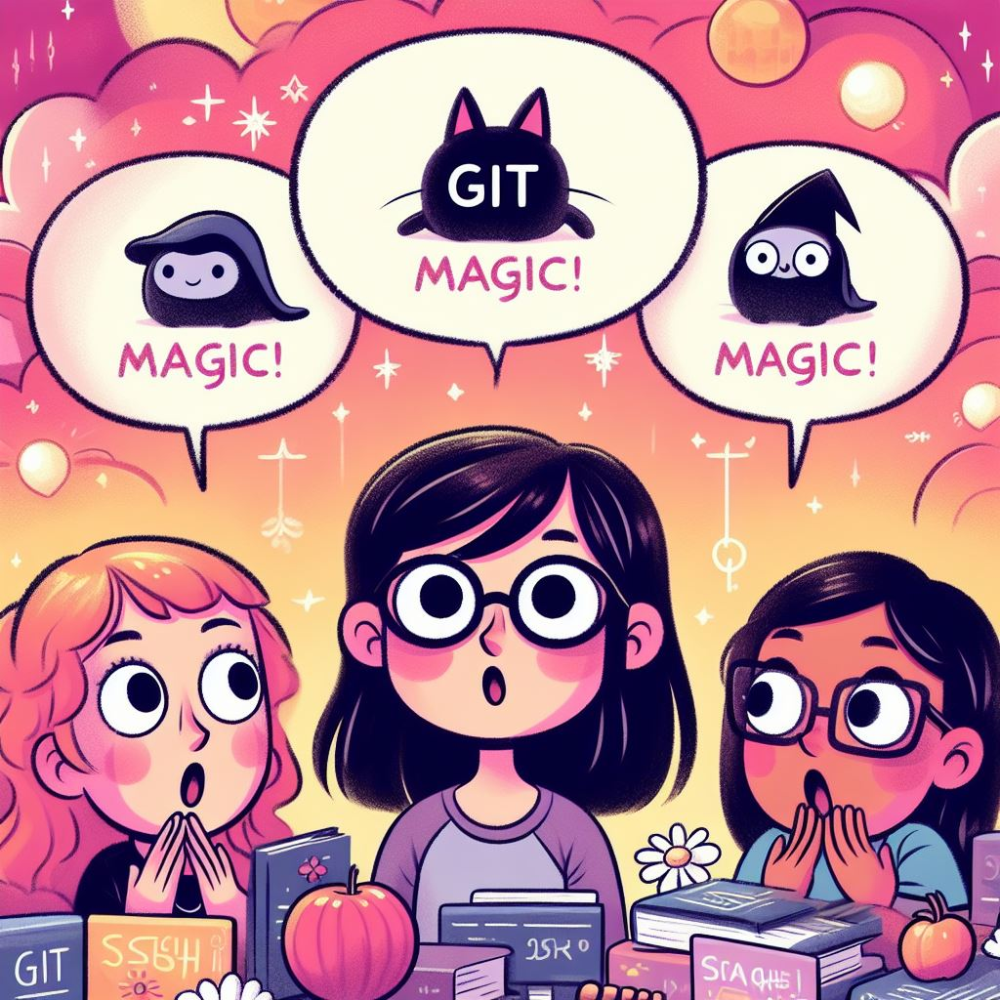

# The Magical Adventures of Sarah the Git Sorceress

## Chapter 1: Sarah's Enchanted Discovery

Sarah was a curious young coder who loved making her computer dance with code.
One day, she overheard her coding companions whispering about a mysterious force
called "Git." Her friend Max explained that Git was a powerful magic that helped
them keep track of their code and work together harmoniously.

With Max's guidance, Sarah began her journey into the realm of Git, learning
enchantments like "git commit" and "git switch" to capture snapshots of her
code's progress and move between different timelines. She felt like a powerful
sorceress, weaving intricate spells to tame her code.

Story by Claude, the Enchanted AI Storyteller
